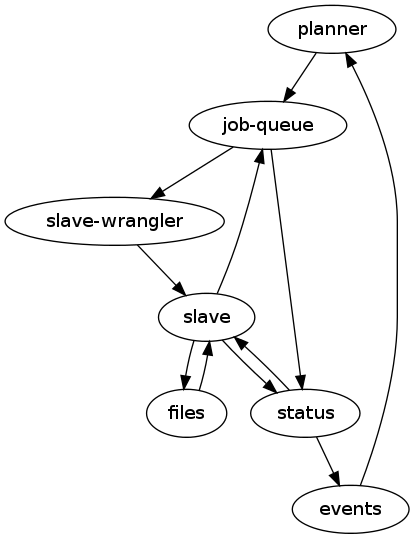

================================
Large Wooden Rabbit Architecture
================================

.. contents::

Overview
========
Large Wooden Rabbit is the code name for the next generation of Release
Engineering's build infrastructure.

http://people.mozilla.org/~asasaki/wb2/01-webbuild2.html

-----
Goals
-----
LWR will:

* be open source
* be made of reusable components
* be usable outside of Mozilla
* allow you to simply rebuild failed tasks, or hierarchies of tasks. These
  rebuilt tasks can satisfy previous dependency graphs.
* allow you to specify DAGs_ for job dependencies
* be able to change scheduling at run time via a web interface or API. some
  examples:

  * enable a new branch
  * change tests running on a branch
  * clone an existing branch config and modify it to report to an alternate
    location. This can be used to test out changes to the scheduling
    process.

* operate at scale. This means:

  * support multiple distributed clusters of slaves and 'masters'
  * support 10\ :sup:`5` slaves
  * support 10\ :sup:`5` pending jobs 

* Allow community members or other developer hosted projects to participate
  more easily

  * allow results to be submitted to be associated with e.g.
    mozilla-central changesets. For example, somebody should be able to
    build a static analysis test on his own machine, and have those results
    available in the same place as the official build and test results,
    associated with the revision of mozilla-central he did the tests from.

  * allow external community systems to connect and get jobs from LWR. This
    could be through direct connections, or a pubsub system.

* Logs and build artifacts are first class objects, not side-effects of
  jobs. LWR will provide clear tools for uploading and referring to logs
  and build artifacts.

.. _DAGs: http://en.wikipedia.org/wiki/Directed_acyclic_graph

---------
Use cases
---------

#. Ability to determine when a whole hierarchy of jobs has finished. For
   example, a developer's push to try triggers opt and debug builds on *N*
   platforms, and each one of those triggers tests. There can also be other
   types of jobs like valgrind or code analysis that.  Currently this is
   difficult in buildbot because there is a very weak correspondence
   betweeen builds and tests triggered via sendchange, as well as the
   asynchronous nature of buildbot scheduling.

   This is currently a pain point with our existing buildbot setup since
   there is no direct relationship between pushes, builds and tests.
   retries and nightly builds add to the confusion. Tools like autoland and
   buildapi have lots of complex code to try and get at all the jobs
   related to one push.

#. Ability to determine what jobs a given event *would* trigger. Kind of
   like a --dry-run mode for planners. This would be used by people
   working on the planners to see if a change they made results in the
   expected jobs.

   This is currently very difficult to do with our existing configs since
   tests are triggered only after builds have finished, so you need to know
   how to line up the build's sendchange with the test schedulers.

#. Cancel a running or pending job.

#. Pause a running job for inspection.
   Arthur, a graphics developer, is trying to track down a test failure. He
   would like to interrupt a running job so that the machine state can
   be inspected while the test is being run. Arthur logs into LWR's web
   interface and sees that a test job is running. He selects the job and
   clicks the "pause button" and then asks buildduty to have a look at the
   machine.

   This is currently impossible to do.

#. Add support for a new branch

#. Test a new planner
   Bilbo, a release engineer, is testing out a change to the
   mozilla-firefox-branch.py planner that creates build and test jobs for
   pushes to firefox repositories. He's already written unittest for the
   planner and verified that it's worked correctly with local testing.
   However, given last week's busted landing, he would like to run this
   side-by-side the existing production planner before going live with
   it.

   Bilbo logs into LWR's web interface and navigates to the planners
   page. He copies the entry for production version of
   mozilla-firefox-branch.py. He modifies his copy to pull from his user
   repository and to report to his bucket, and then clicks "Save changes."

   From that point on, all the same events which cause
   mozilla-firefox-branch to run will cause Bilbo's modified planner to
   run as well.

   We try and accomplish this currently by running things in our staging
   environment. The problems with this are that the staging slaves are
   often tainted by previous work, there are not enough resources to go
   around, and it's impractical to test all the affected builders for many
   changes.

#. Hal, a mobile developer, is trying to get a new test suite up and
   running for the android builds. He would like to test his new robocop
   test using the test code in his repository against last night's android
   build.

   Because Hal doesn't need all the newfangled features of LWR's planners,
   he decides to kick off the tests manually. The first time Hal needs to
   do this, he logs onto LWR's interface and goes to the Jobs section. He
   selects 'new job' which opens an interface that allows him to specify
   which script will be run, which parameters to pass it it and which
   slave(s) to run the job on. When he's done, he can click on 'do it!',
   which will create his new job in the `job queue`_.

   If this is not his first time doing this, he can go to the status
   interface of LWR and find his previous test run by searching for jobs
   with his username associated with them, or with the string 'robocop' in
   their name. He can then select 'edit & run again' which will open an
   interface that allows him to edit the parameters of the test run.
   Excited that he'll finally be able to get the tests passing, he updates
   the revision of his test repository that the test job is using, and
   clicks 'do it!'.

   Joel is Hal's manager, and wants to see how far along Hal is to
   completing his work since the deadline is next week. He also can use the
   status interface of LWR to look at all of Hal's jobs and filter out all
   the jobs except robocop. Happily the tests have just started passing.
   
----------
Anti-Goals
----------
LWR will not:

* replace TBPL_, although it should simplify fetching of build results

* gain you access to fortified french castles 

.. _TBPL: http://tbpl.mozilla.org

----------
Why not X?
----------

Buildbot
--------
Buildbot has served us well, but has a few fundamental limitations that
are very difficult to change or work around:

* require constant connection between build master and slave. This puts a
  high load on network infrastructure which causes burnt builds/tests due
  to dropped connections, and makes it hard to do maintenance on masters.
  Having build slave <-> master(s) communication be resilient to failure or
  being able to have slaves fall over to another master would be a great
  improvement to system stability.

* scheduling is opaque and difficult to change at run-time. buildbot
  doesn't provide much in the way of interfaces to the schedulers.
  Sometimes they log things to the master log files, most of the time
  they don't. Debugging misbehaving schedulers is a bit of a black art.
  Execution of one scheduler can block execution of other schedulers.
  It's also difficult to alter the set of jobs that happen as part of a
  build or test run at runtime. reconfigs don't cut it.

* poor support for non-trivial hierarchies of jobs. If you have a process
  with many fanout and collection points, it's very difficult to
  represent this in buildbot. It's even harder to know reliably when
  everything in the process is done.

* no single source of truth for build status. We've been maintaining our
  own mysql database to store build status, but it's not directly
  associated with the schedulerdb. Providing a consistent view of these
  databases is complicated; exports to other applications is expensive and
  complex.

if we were to modify buildbot, this is what we would need to change:

* improved master <-> slave connection. a dropped connection shouldn't fail
  a build. a slave should be able to fail over to another master

* status should be in a database. it should be easy to run something like
  tbpl on top of the database.

* more flexible scheduling - external scheduling scripts

* build hierarchies

* better integration of logging - should be easier to treat as a build
  artifact

wishlist:

* zmq

* gevent? (TODO is there a twisted reactor implemented with gevent?)

questions:

* how can external contributers work with it?

* can we support one-off custom jobs? developer maintained jobs?

Jenkins/Hudson
--------------
Jenkins seems well suited to simple processes, but not for handling a large
set of complex tasks.

I really don't know it well enough to evaluate though. It's written in java
though :\\

Components
==========

-------
Planner
-------
The planner is responsible for responding to events and creating new jobs.
The planner maintains a list of plan_\ s that respond to incoming
events and create new jobs to run in reponse to those events.

ZMQ API
-------
The planner listens on a REP socket for `event`_\ s using the regular ZMQ_
protocol and replies with ``{"ok": true, "id": event_id}`` if the event was
accepted. ``"id"`` is optional depending if there is an event store or not.
If the event can't be processed for some reason, the planner should respond
with e.g. ``{"ok": false, "msg": "too many fizzbangs"}``.

HTTP API
--------
The planner provides a pretty web interface built on top of a web API.

V0.1 Planner HTTP API
~~~~~~~~~~~~~~~~~~~~~
``GET /planner/v0.1/<bucket>``
    lists all plans in this bucket

``POST /planner/v0.1/<bucket>``
    create a new plan

``PUT /planner/v0.1/<bucket>/<plan_id>``
    update a plan

``DELETE /planner/v0.1/<bucket>/<plan_id>``
    delete a plan

See plan_ for the object specification.

The ``owner`` field can be ommitted in which case the currently logged in
user is set as the owner. It can also be set to any user or group with read
access to the bucket.

The ``bucket`` field of the scheduler is implicit in the API call and
cannot be overridden.

A scheduler here is a json document like::

    {
        "event_types": [...],
        "job_template": {...},
        "data": {...},
        "owner": "owner or group",
    }

`Planner`_ -> `Job Queue`_
--------------------------
The `planner`_ has a one-way communication with the `job queue`_, it simply
notifies the `job queue`_ of new jobs to run.

* New job

Event_ -> Planner_
------------------
* new pushes to hg / git / cvs / etc.
* triggers
* builds starting / builds stopping

---------
Job Queue
---------
The `job queue`_ is responsible for tracking new jobs, sending them for
execution to the `slave wrangler`_ if required, or queuing them up for later
processing.

All modifications to jobs are done through this component. This includes
cancelling or pausing jobs.

TODO:
It's a bit weird that there's little reading done from the queue. It looks
like a scheduler will have to query status_ to find old jobs/jobsets to act
on. either that or `job queue`_ will duplicate a lot of status_, which
doesn't seem like a good idea.

Although, these scheduling decisions are inherently racey and
asynchronous, so perhaps splitting it up is fine.

One of the primary uses that would involve both getting other job statuses
and modifying others is schedulers that merge pending requests. They need
to get a list of pending jobs of a certain type (TODO: figure out if this
is easy or not!), and mark the older ones are merged.

HTTP API
--------

``POST /jobqueue/v0.1/<bucket>/jobs``
    create a new job.
    the id for the job is returned by this call.

``POST /jobqueue/v0.1/<bucket>/job/<jobid>/trigger``
    fire a trigger.
    TODO: Use events for this instead?

``PUT /jobqueue/v0.1/<bucket>/job/<jobid>``
    modify this job's state to cancel it, merge it, etc.

    post-data:

    state=running, cancelled, paused, merged, etc.

ZMQ API
-------
The `job queue`_ server(s) listen on a REP socket. Requests are made by
clients using a REQ socket with the following format:

TODO

`Job Queue`_ -> `Slave Wrangler`_
---------------------------------
* Run job A on slave X

`Job Queue`_ -> Status_
-----------------------
* Job A is new, running, pending, merged, etc.

--------------
Slave Wrangler
--------------
Receives jobs from the `job queue`_ and runs them on slaves.

Mostly just a broker to talk to slaves.

`Slave Wrangler`_ -> `Slave`_
------------------------------
* Run job A

-----
Slave
-----
Slaves do work!

Slave_ -> `Job Queue`_
----------------------
* Create new job
* Send trigger (TODO: should this go via events? - that lets regular
  subscriptions to event types work for the jobset scheduler)
* Delete jobs (e.g. a scheduler job could cancel other pending work)
* Merge jobs (e.g. a scheduler job could merge pending work together)

Slave_ -> Files_
----------------
* Upload files and logs, store urls
* See also `Files -> Slave`_

Slave_ -> Status_
-----------------
Notification of job status: started, finished, including meta data like:

* build started/finished
* start/stop time
* per-step start/stop time
* results (success, failure, etc.)
* rich results (??? e.g. multi l10n repacks)
* urls to logs, files
* See also `Status -> Slave`_

------
Status
------
Get and retrieve status on individual jobs and job sets.

HTTP API
--------
``GET /status/v0.1/<bucket>/jobs/<jobid>``
    get status about job $jobid

``GET /status/v0.1/<bucket>/jobsets/<jobsetid>``
    get status about $jobsetid

``GET /status/v0.1/<bucket>/bytags/<tags>``
    get status about jobs associated with $tags

``POST /status/v0.1/<bucket>/jobs``
    TODO: is this required? this doesn't actually cause a new job to get run
    create new job

``POST /status/v0.1/<bucket>/jobsets``
    TODO: is this required? this doesn't actually cause a new jobset to exist
    create new jobset

``PUT /status/v0.1/<bucket>/jobs/<jobid>``
    update job

``PUT /status/v0.1/<bucket>/jobsets/<jobsetid>``
    update job set

Except for searching for things by tag, this looks an awful lot like S3....

ZMQ API
-------
The Status_ server(s) listen on a REP socket. Requests are made by clients
using a REQ socket with the following format:

* Frame 0
    ``version``
        status protocol version (0.1)

    ``auth``
        authentication information

    ``bucket``
        which bucket we're talking to

    ``method``
        ``getjob``, ``getjobset``, ``newjob``, ``newjobset``, ``updatejob``,
        ``updatejobset``

* Frame 1
    ``job`` or ``jobset`` data

Status_ -> Slave_
-----------------
* fetch status of old jobs (e.g. a scheduler job might want to know state of other jobs)

Status_ -> Event_
------------------
* job finished
* job added

-----
Files
-----
Files and logs go here.

The APIs for this should be pretty simple. You need to be able to upload a file and get back a URL. The existing scp / post_upload.py would suffice.

Files_ -> Slave_
----------------
* Download files

Object and type Definitions
===========================

---------------
Dates and times
---------------
Dates and times will be transferred as unix timestamps (seconds since Jan
1, 1970 UTC).

-----
Event
-----
Events are used by a few things in LWR:

* notifications of external things that require action, e.g.

  * hg pushes

  * request for custom build

* internally generated events

  * build finished. this in turn can trigger another scheduler to run more
    builds / tests

  * build trigger. e.g in our existing build process we run 'sendchange'
    after uploading so that tests can get started before things like 'make
    check' are run.

* most events are published for external consumers via http or rmq

* event publishing is controlled by bucket policy

Events are specified as a dictionary / object.

Version 0
---------
::

    key     description
    ---     -----------
    v       version - set to the number 0
    owner   name of who sent this event
    bucket  what bucket this event belongs to
    name    what this event is called
    data    event specific data
    log     a list of (time, description) tuples listing where this event
            was created, where it was received, etc. the format of
            description is unspecified.
    sigs    a list of signatures

    For example:
    {
        "v": 0,
        "owner": "hg",
        "bucket": "public",
        "name": "hg.pushes.mozilla-central",
        "data": {
                    "rev": "1234567890abcdef",
                    "pusher": "joe",
                    "time": 123456789,
                },
        "sigs": [
                {"v": 0, "type": "null"},
                ],
        "log": [
                (123456789, {"created_by": "hg on hg2.scl3.mozilla.com"}),
                (123456790, {"received_by": "planner on lwr1.build.scl3.mozilla.com"}),
               ],
    }

---------
Signature
---------
Signatures are attached to many objects in LWR. A single signature is
specified as an object.

Version 0
---------
::

    key     description
    ---     -----------
    v       version - set to the number 0
    type    type of signature. supported formats for version 0 are:
            "null" - no signature

----
Plan
----
A plan is basically a job template with a list of event subscriptions.
The job template will be instantiated when a matching event is received by
the planner. The event will be attached to the job and then sent to the
`job queue`_.

Plans are managed and triggered by the planner_. The following is mostly
implementation details as plans are not normally interacted with by users
or slave machines.

Some examples:

* A "jobset" plan subscribes to "<bucket>.build.finished",
  "<bucket>.build.trigger", "<bucket>.jobsets.new" events and creates a job
  that determines if any new jobs in a jobset are runnable.

* A "mozilla" plan subscribes to hg push events and creates a full
  hierarchy of builds and tests (a `job set`_) with proper dependencies
  between them.

Version 0
---------
::

    key     description
    ---     -----------
    v       version - set to the number 0
    owner   name of who owns this plan - also who will own any created
            jobs
    bucket  which bucket created jobs will go into
    events  a list of "bucket.event_name" strings to indicate which events
            this plan is subscribed to
    job_template
            trimmed down job document that is used to create new jobs in
            response to events
            the "command", "tags" and "interpreter" fields are required"
    data    extra data to attach to the job

-------
Job Set
-------
A job set is a `directed acyclic graph`_ that describes a hierarchy of jobs
to run and how they're related. An example would be the set of builds
created for an hg push, and the tests for that build. The tests depend on
the builds to succeed. By creating everything under a single jobset you can
know when everything is completed or not, and have a place to look up all
the results associated with a single push.

Another example would be our release automation. We have a fairly complex
set of dependencies between tagging / builds / repacks / updates (en-US
builds depend on en-US tagging, repacks depend on locale tagging and en-US
builds, updates depend on builds, partner repacks depend on repacks, virus
scan depends on everything, ...)

Sample format::

    A -> B -> C
         B -> D
              D -[trigger t1]-> F
         B -[onfailure]-> E

Where A,B,C,D,E are job ids. A is run first.
If A succeeds, then B is run.
If B succeeds, then C and D are run.
If B fails, then E is run.
If D generates trigger t1, then F is run

.. _directed acyclic graph: http://en.wikipedia.org/wiki/Directed_acyclic_graph

To submit a job set, each job in the set should be created first with
state=waiting, and then the jobset can be created referencing all the job
ids. Once the jobset is submitted the jobset planner will run and mark
any jobs in the jobset as runnable.

---
Job
---
A job is an object that has the following fields:

* ``id``
    a unique identifier for the job

* ``command``
    the command to run. this will be a regular string processed by whatever
    ``interpreter`` is selected below. It can be omitted if ``command_url``
    is provided.

* ``command_url``
    url to a command to run. the file at the specified url will be
    downloaded locally and then run by the specified ``interpreter``

* ``tags``
    list of strings to tag the jobs with. some of these may be restricted
    due to policy

* ``starttime/stoptime``

* ``state``
    One of:

    ``pending``
        this job is waiting for something else to complete before it can run
    ``runnable``
        this job can be run
    ``running``
        this job is running
    ``finished``
        this job is done
    ``paused``
        this job has been paused by a user

* ``status``
    a code indicating whether the job was successful, failed, etc.

* ``required_slave_tags``
    what type of slave this job needs

* ``interpreter``
    how should the command be run (python, bash, etc.)

* ``data``
    data from planner

* ``event``
    which event triggered this job

* ``planner_id``
    which planner triggered this job

* ``bucket``
    what bucket this job is in

* MOAR!

Access control
==============

There are at least two options under consideration for managing access
control. We will attempt to outline them here so that a decision can be
reached.

The goals for access control are:

1. allow community projects to submit results without risk of polluting
   other projects' data

2. make it possible to identify the canonical builds and test results for
   any project

3. identify the 'owner' for jobs, planners, and files for resource
   allocation

4. make it possible to have jobs and results that are non-public (e.g.
   fuzzing, work for security bugs)

5. allow users to create their own planners, and to manage their own jobs.

6. make it possible to submit auxilliary information to existing projects
   (e.g. tier-2 builds, static analysis of mozilla-central)

-------
Buckets
-------
Every planner, job, status object, file has another piece of metadata
attached which is called its bucket.

There also exist users and groups in the system.

Buckets have a list of users and groups with read/write permissions.

Planners create jobs in their own bucket. Jobs report results to the same
bucket.

How does it accomplish the goals?

1. since results for jobs are contained to their bucket, there is no risk
   of pollution. each project (e.g. 'firefox', 'jetpack', 'thunderbird',
   'seamonkey') could have its own bucket.

2. owners of the jobs can tag items in their bucket with 'official' if it's
   desirable for them to do that. presumably only builds/tests in the
   'firefox' are canonical. extra tags could be added to distinguish dep
   builds from nightlies from release, etc.

3. resource allocation could be done per bucket rather than for individual
   users or groups. 

4. non-public jobs would go into buckets with limited read/write access

5. a user with write permissions to a bucket is able to create/modify the
   set of planners. the same technique could be used to allow running new
   jobs, cancelling running ones, etc.

6. leave it to the status displays (e.g. tbpl) to select which buckets and
   results they want to look at

Pros:

* simple

Cons:

* puts more burden on status displays to look in all buckets they're
  interested in. this could be a good thing, it enforces goal 1.

------------
random ideas
------------
*This section isn't finished yet - just some random thoughts here for now*

What about buckets? S3 gives coarse grain access control with
buckets...that's nice!  It's also gives you a separate namespace per
bucket, which is also nice!

possible buckets:

- mozilla-central
- mozilla-inbound
- nanojit
- thunderbird/mozilla-central
- mozilla-release
- seamonkey/mozilla-central
- emscripten
- tenfourfox/mozilla-central
- fuzzing
- mozilla_releng

however, access control at a per bucket level would make it hard for
community projects to be involved, unless they were given their own bucket.
in the case of several projects based around a single repository, but
spread across many buckets, status reporting tools (like tbpl) would need
to know to look in different buckets for results. The status_ API could
include querying by bucket as well as by tag, or buckets could be an
implicit tag.

Can we have hierarchical name spaces?

- mozilla-central.firefox
- mozilla-central.tenfourfox
- mozilla-central.thunderbird

instead, can we have ACLs on certain tags?

e.g.:
    "mozilla-central": requires auth releng

    "mozilla-central", "static-analysis": requires auth foo

    "mozilla-central", "comm-central", "seamonkey": requires auth bar

    "mozilla-central", "release": requires auth releng

the more I think about this, the more I like buckets. trying to resolve
ACLs on sets of tags seems complicated.

having a single flat bucket namespace is clean and simple.

Resource policies
=================
We need to enforce certain kind of resource policies or prioritizations,
e.g.:

- mozilla-central builds are more important than elm

- fuzzing jobs should only happen at idle time, and make sure that it
  doesn't consume all available slaves

- mozilla-central should be guaranteed X% of the resources

- guarantee Y% to developer / community jobs.

Protocols
=========

----
HTTP
----
Authentication to HTTP interfaces is a deployment issue, and depends which
clients are going to be accessing it. For user facing interfaces, HTTP
Basic or Digest authentication or even BrowserID could work. For automated
systems, HTTP Basic or Digest could be used, or a simpler token system.

In any case, the web service will trust the ``REMOTE_USER`` variable in the
environment for authentication.

---
ZMQ
---

All ZMQ messages use a common message header. The message begins with a
single byte which represents the protocol version. The meaning of following
bytes are defined by the version.

Version 0
---------
::

    byte(s) description
    ------- -----------
    0       b'\x00' - version code '0'
    1       encoder id
    2       compressor id
    3-      message data

    defined encoders:
    0 - raw
    1 - json
    2 - msgpack

    defined compressors
    0 - raw
    1 - zlib

    implementations are required to support the raw and json encoders as
    well as the raw compressor.

    TODO: describe encoder/compressor negotiation

TODO
====

* Policy control

  * who can run what type of jobs, and how often?
  * control over tags
  * resource allocation

* Integration with other tools, like tree status - when tree is closed,
  stop new jobs from getting scheduled. When infra fails, automatically
  close tree.

* Data integrity - how do we ensure that commands and build artifacts are
  transferred throughout the system without tampering

* Managing secrets. Lots of times we have slaves deal with sensitive
  information. How can we get secrets on and off of the slaves securely?

* Log streaming. It would be nice to be stream log files to developers. I
  think zmq would be great for this.

* reaper, ttls for pending work

* chaos monkey

* timers (for generating events)

* is merging in the planner job the right thing to do?
  a planner job has the context and knowledge for what types of jobs are
  mergable and not, and how many could be merged at once

  buildbot currently merges at the time when jobs are assigned to slaves

* performance monitoring, correspond to build 'steps'

    * mozharness could dump out current step to well defined location
      (file)

    * integrate vnc / console?
      slave software should be able to record cpu, memory, running processes,
      get a screenshot, free disk space

* breakpoints for jobs? (supported by extra data sent in event, passed
  along to mozharness script?) job can pause itself? pause-after-run.

* jobs that span slaves

* "reserving" slaves between jobs

* where does job prioritization happen? can it be a separate script?

* Figure out ACLs / buckets / etc.

* Configuration-as-code has the advantage of being able to put the
  configuration in source control.
