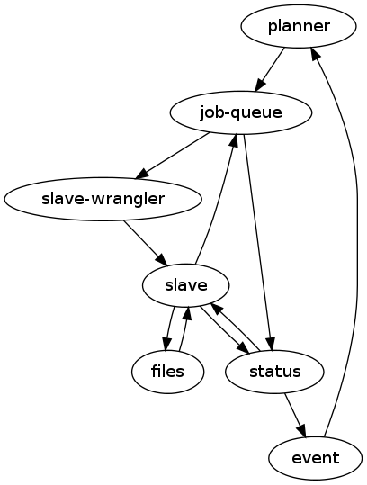

================================
Large Wooden Rabbit Architecture
================================

.. contents::

Overview
========
Large Wooden Rabbit is the code name for the next generation of Release
Engineering's build infrastructure.

-----
Goals
-----
LWR will:

* allow you to simply rebuild failed tasks, or hierarchies of tasks. These
  rebuilt tasks can satisfy previous dependency graphs.
* allow you to specify DAGs for job dependencies
* be able to change scheduling at run time via a web interface or API. some
  examples:

  * enable a new branch
  * change tests running on a branch
  * clone an existing branch config and modify it to report to an alternate
    location. This can be used to test out changes to the scheduling
    process.

* operate at scale. This means:

  * support multiple distributed clusters of slaves and 'masters'
  * support 10\ :sup:`5` slaves
  * support 10\ :sup:`5` pending jobs 

* Allow community members or other developer hosted projects to participate
  more easily

  * allow results to be submitted to be associated with e.g.
    mozilla-central changesets. For example, somebody should be able to
    build a static analysis test on his own machine, and have those results
    available in the same place as the official build and test results,
    associated with the revision of mozilla-central he did the tests from.

  * allow external community systems to connect and get jobs from LWR. This
    could be through direct connections, or a pubsub system.

----------
Anti-Goals
----------
LWR will not:

* gain you access to fortified french castles 

----------
Why not X?
----------

Buildbot
--------
Buildbot has served us well, but has a few fundamental limitations that
are very difficult to change or work around:

* require constant connection between build master and slave. This puts a
  high load on network infrastructure which causes burnt builds/tests due
  to dropped connections, and makes it hard to do maintenance on masters.
  Having build slave <-> master(s) communication be resilient to failure or
  being able to have slaves fall over to another master would be a great
  improvement to system stability.

* scheduling is opaque and difficult to change at run-time. buildbot
  doesn't provide much in the way of interfaces to the schedulers.
  Sometimes they log things to the master log files, most of the time
  they don't. Debugging misbehaving schedulers is a bit of a black art.
  Execution of one scheduler can block execution of other schedulers.
  It's also difficult to alter the set of jobs that happen as part of a
  build or test run at runtime. reconfigs don't cut it.

* poor support for non-trivial hierarchies of jobs. If you have a process
  with many fanout and collection points, it's very difficult to
  represent this in buildbot. It's even harder to know reliably when
  everything in the process is done.

* no single source of truth for build status. We've been maintaining our
  own mysql database to store build status, but it's not directly
  associated with the schedulerdb. Providing a consistent view of these
  databases is complicated; exports to other applications is expensive and
  complex.

Jenkins/Hudson
--------------
Jenkins seems well suited to simple processes, but for handling a large set
of complex tasks.

I really don't know it well enough to evaluate though. It's written in java
though :\\

Components
==========

-------
Planner
-------
The planner is responsible for responding to events and creating new jobs.
Scheduler_ definitions live in the planner. When an event is received that a
scheduler is subscribed to, the planner will create a job to run that
scheduler.

`Planner`_ -> `Job Queue`_
--------------------------
The `planner`_ has a one-way communication with the `job queue`_, it simply
notifies the `job queue`_ of new jobs to run.

* New job

---------
Job Queue
---------
The `job queue`_ is responsible for tracking new jobs, sending them for
execution to the `slave wrangler`_ if required, or queuing them up for later
processing.

All modifications to jobs are done through this component. This includes
cancelling or pausing jobs.

`Job Queue`_ -> `Slave Wrangler`_
---------------------------------
* Run job A on slave X

`Job Queue`_ -> Status_
-----------------------
* Job A is new, running, pending, etc.

--------------
Slave Wrangler
--------------
Receives jobs from the `job queue`_ and runs them on slaves.

Mostly just a broker to talk to slaves.

`Slave Wrangler`_ -> `Slave`_
------------------------------
* Run job A

-----
Slave
-----
Slaves do work!

Slave_ -> `Job Queue`_
----------------------
* Create new job
* Send trigger
* Delete jobs (e.g. a scheduler job could cancel other pending work)
* Merge jobs (e.g. a scheduler job could merge pending work together)

Slave_ -> Files_
----------------
* Upload files and logs, store urls
* See also `Files -> Slave`_

Slave_ -> Status_
-----------------
Notification of job status: started, finished, including meta data like:

* build started/finished
* start/stop time
* per-step start/stop time
* results (success, failure, etc.)
* rich results (??? e.g. multi l10n repacks)
* urls to logs, files
* See also `Status -> Slave`_

------
Status
------
Get and retrieve status on individual jobs and job sets.

HTTP API
--------
GET /status/jobs/<jobid>
    get status about job $jobid

GET /status/jobsets/<jobsetid>
    get status about $jobsetid

GET /status/bytags/<tags>
    get status about jobs associated with $tags

POST /status/jobs
    create new job

POST /status/jobsets
    create new jobset

PUT /status/jobs/<jobid>
    update job

PUT /status/jobsets/<jobsetid>
    update job set

Status_ -> Slave_
-----------------
* fetch status of old jobs (e.g. a scheduler job might want to know state of other jobs)

Status_ -> Events_
------------------
* job finished
* job added

------
Events
------

Events_ -> Planner_
-------------------
* new pushes to hg / git / cvs / etc.
* triggers
* builds starting / builds stopping

-----
Files
-----
Files and logs go here.

The APIs for this should be pretty simple. You need to be able to upload a file and get back a URL. The existing scp / post_upload.py would suffice.

Files_ -> Slave_
----------------
* Download files

Objects
=======

---------
Scheduler
---------
A scheduler is basically a job template with a list of event subscriptions.
The job template will be instantiated when a matching event is received by
the planner. The event will be attached to the job and then sent to the
`job queue`_.

Schedulers are managed and triggered by the planner_.

Some examples:

* A "jobset" scheduler subscribes to "build.finish", "build.trigger" events
  and creates a job that determines if any new jobs in a jobset are
  runnable.

* A "mozilla" scheduler subscribes to hg push events and creates a full
  hierarchy of builds and tests (a `job set`_) with proper dependencies
  between them.

-------
Job Set
-------
A job set is a `directed acyclic graph`_ that describes a hierarchy of jobs
to run and how they're related. An example would be the set of builds
created for an hg push, and the tests for that build. The tests depend on
the builds to succeed. By creating everything under a single jobset you can
know when everything is completed or not, and have a place to look up all
the results associated with a single push.

Another example would be our release automation. We have a fairly complex
set of dependencies between tagging / builds / repacks / updates (en-US
builds depend on en-US tagging, repacks depend on locale tagging and en-US
builds, updates depend on builds, partner repacks depend on repacks, virus
scan depends on everything, ...)

Sample format::

    A -> B -> C
         B -> D
         B -[onfailure]-> E

Where A,B,C,D,E are job ids. A is run first. If A succeeds, then B is run.
If B succeeds, then C and D are run. If B fails, then E is run.

.. _directed acyclic graph: http://en.wikipedia.org/wiki/Directed_acyclic_graph

---
Job
---
A job is an object that has the following fields:

* ``id``
    a unique identifier for the job

* ``command``
    the command to run

* ``tags``
    list of strings to tag the jobs with. some of these may be restricted
    due to policy

* ``starttime/stoptime``

* ``status``
    a code indicating whether the job was successful, failed, etc.

* ``required_slave_tags``
    what type of slave this job needs

* MOAR!

Access control
==============
*This section isn't finished yet - just some random thoughts here for now*

What about buckets? S3 gives coarse grain access control with
buckets...that's nice!  It's also gives you a separate namespace per
bucket, which is also nice!

possible buckets:

- mozilla-central
- mozilla-inbound
- nanojit
- thunderbird/mozilla-central
- mozilla-release
- seamonkey/mozilla-central
- emscripten
- tenfourfox/mozilla-central
- fuzzing

however, access control at a per bucket level would make it hard for
community projects to be involved, unless they were given their own bucket.
in the case of several projects based around a single repository, but
spread across many buckets, status reporting tools (like tbpl) would need
to know to look in different buckets for results. The status_ API could
include querying by bucket as well as by tag, or buckets could be an
implicit tag.

Can we have hierarchical name spaces?

- mozilla-central.firefox
- mozilla-central.tenfourfox
- mozilla-central.thunderbird

instead, can we have ACLs on certain tags?

e.g.:
    "mozilla-central": requires auth releng

    "mozilla-central", "static-analysis": requires auth foo

    "mozilla-central", "comm-central", "seamonkey": requires auth bar

    "mozilla-central", "release": requires auth releng

TODO
====

* Policy control

  * who can run what type of jobs, and how often?
  * control over tags
  * resource allocation

* Split up `job queue`_ into pieces that queue jobs, mark as runnable, etc.?

  * marking jobs as runnable is handled by a scheduler that manages job
    sets.

* Integration with other tools, like tree status - when tree is closed,
  stop new jobs from getting scheduled. When infra fails, automatically
  close tree.

* Data integrity - how do we ensure that commands and build artifacts are
  transferred throughout the system without tampering
